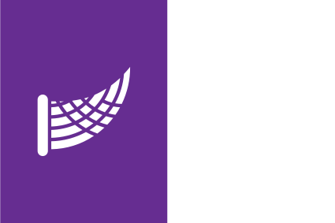
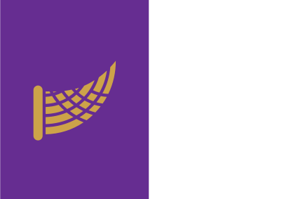
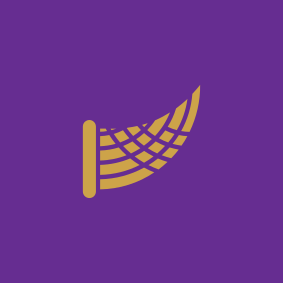
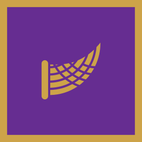
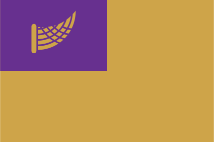
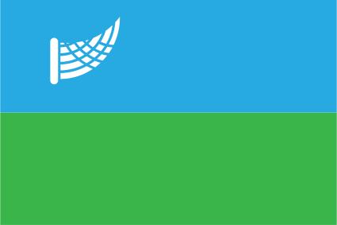
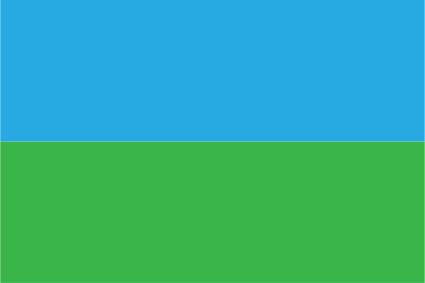

# Allemance

The ancient colours of what is now Allemance are purple and white. Purple represents the land's wealth, while white represents the purity of its people — at least according to the official explanation. The first flag in use was therefore a purple and white banner.

## Lupine Kingdom of Allemance, Tibelle dynasty

The first official flag, established during the Tibelle dynasty, featured vertical bisection (per pale). The hoist field is purple with white cornucopia (again, symbolizing the Alley fields as bread basket of the known world), the fly side is white. 

## Lupine Kingdom of Allemance

When the Andolesian dynasty took over, they made a small alteration to the ancient flag by changing the colour of the cornucopia to gold to symbolise the wealth and prosperity that would be enjoyed under their rule.

## Royal banner

The royal banner of Allemance is purple field with the gold cornucopia. The royal banner represents the authority of the Lupine throne and may be used by high-ranking officials.

## Personal standard of the Queen

The Queen's personal standard is the same as the royal banner, but has a gold border. It is used only for reigning queen personally.

## Flags of cities and baronies

During the consolidation of the nobility, all other flags were updated as well. All flags in Allemance (baronies, big crown cities) have purple canton with gold cornucopia (compare with flags of many former British colonies). 

Pictured is the flag of the capital city of Louvain.

## Flag of Glasrún

The only exception to this rule is the independent province of Glasrún. Its flag features a horizontal division, with the bottom field green to symbolise the green forests that gave Glasrún its name, and the top field sky blue to represent the clear sky. They adopted the Allemancian cornucopia in the canton of their flag, but omitted the royal purple to symbolise their independence.

However, some people, particularly those around Barraille, reject the Alley connection and prefer to use the traditional plain version as a political statement.
