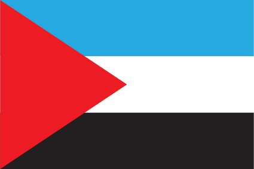
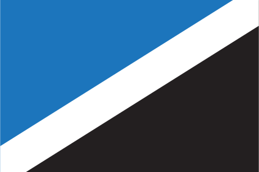
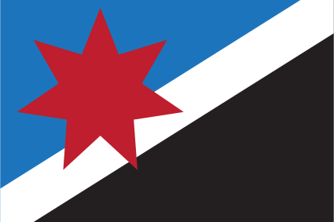

# Oria

Oria is not a country and does not have a single flag. But the distinct communities usually have some sort of flag or banner. It seems to be crucial to human nature to have a flag, as all nations and most other significant communities or movements have one.

The common colors of Orian flags are black (for the rocky mountains), white (for the snow), and blue (representing the sky). These three basic colors are often accompanied by red and/or some kind of symbol that is important to the community.

Below are some flags of various Orian communities.

