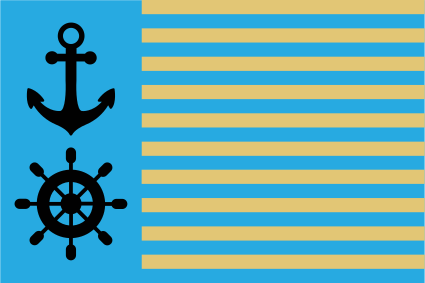
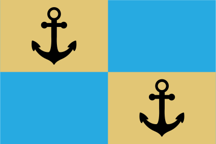
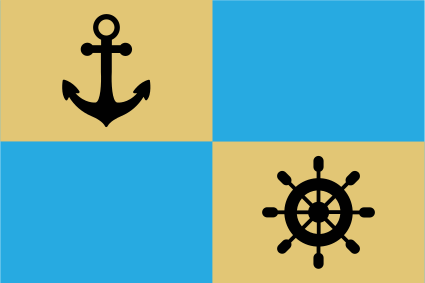
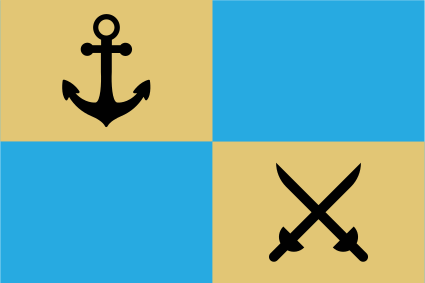

# Vinyot

## Trade League of Vinyot

> The League is not a state, but fulfills many functions of one, so it's logical that it would have a flag.

The flag field (3:2 aspect ratio) is blue, with a black anchor and rudder on the hoist side. The fly side is divided by horizontal yellow (gold) stripes, the number of which corresponds to the number of League members. As the number can change, the flags in use should also change, which often results in outdated flags being displayed.

The yellow (gold) represents the wealth of the League members and the blue represents the ocean from which it originates. The black anchor symbolises the stability that the League provides, as well as its ships. The rudder symbolises direction and control.

### Civil Ensign

> The changing nature of the main flag lead to adoption of three separate versions (ensigns) for maritime use. This is actually real tradition on Earth, nations with important naval presence often have different flags for use on sea.

The civil ensign is displayed by civilian (merchant) ships on sea. Its blue field is divided to quarters (party per cross). The canton and diagonally opposite quarters are yellow (gold) with black anchors.

### State Ensign

> State ensign is traditionally flown on government operated vessels, or vessels transporting state officials. In case of the League, this ensign is used on sea when the vessel transports some League dignitary or performs some other official or diplomatic duty commissioned by the League itself.

Its blue field is divided to quarters (party per cross). The canton quarter is yellow (gold) with black anchor, diagonally opposite quarter is yellow (gold) with black rudder, meaning the League guidance.

### Naval Ensign

> Naval ensign (also called war ensign) is traditionally flown on military (navy) vessels. The League does not have any official army per se, but this ensign is used by the pirate hunting corps.

The blue field is divided to quarters (party per cross). The canton quarter is yellow (gold) with black anchor, diagonally opposite quarter is yellow (gold) with black crossed swords. The swords symbolize the force used for defeating the pirates.

## Flags of Trade Lords 

The above are flags of the League itself. 

Each Trade Lord will have their own flag or banner. Whilst these banners tend to utilise the same customary colours and symbols, they can vary considerably, with some being utterly abhorrent.  For inspiration on what they might look like, take a look at the [flags of the US states](https://en.wikipedia.org/wiki/Flags_of_the_U.S._states_and_territories).